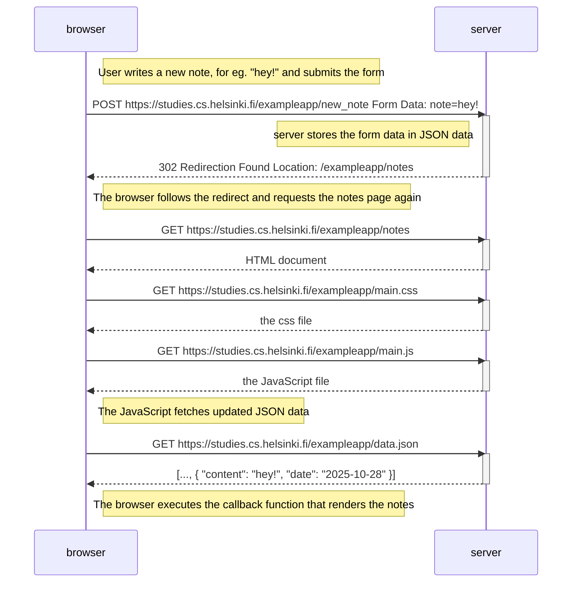

```mermaid
sequenceDiagram
    participant browser
    participant server

    Note right of browser: User writes a new note, for eg. "hey!" and submits the form

    browser->>server: POST https://studies.cs.helsinki.fi/exampleapp/new_note  Form Data: note=hey!
    activate server
    Note left of server: server stores the form data in JSON data

    server-->>browser: 302 Redirection Found  Location: /exampleapp/notes
    deactivate server

    Note right of browser: The browser follows the redirect and requests the notes page again

    browser->>server: GET https://studies.cs.helsinki.fi/exampleapp/notes
    activate server
    server-->>browser: HTML document
    deactivate server

    browser->>server: GET https://studies.cs.helsinki.fi/exampleapp/main.css
    activate server
    server-->>browser: the css file
    deactivate server

    browser->>server: GET https://studies.cs.helsinki.fi/exampleapp/main.js
    activate server
    server-->>browser: the JavaScript file
    deactivate server

    Note right of browser: The JavaScript fetches updated JSON data

    browser->>server: GET https://studies.cs.helsinki.fi/exampleapp/data.json
    activate server
    server-->>browser: [..., { "content": "hey!", "date": "2025-10-28" }]
    deactivate server

    Note right of browser: The browser executes the callback function that renders the notes
```