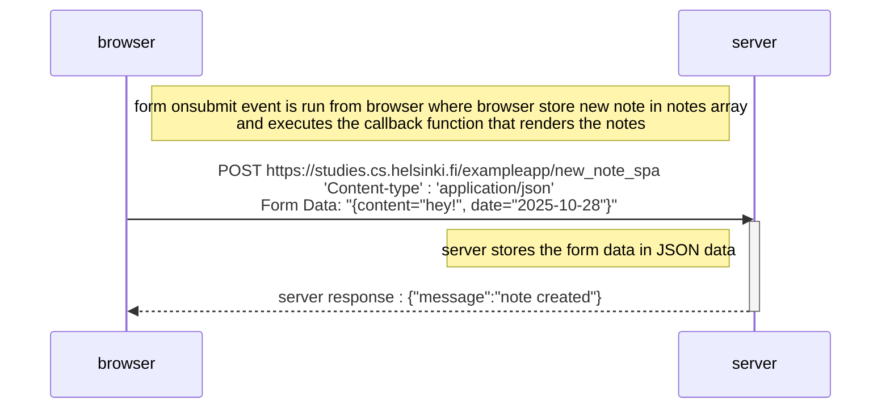

```mermaid
sequenceDiagram
    participant browser
    participant server

    Note right of browser: form onsubmit event is run from browser where browser store new note in notes array<br/>and executes the callback function that renders the notes

    browser->>server: POST https://studies.cs.helsinki.fi/exampleapp/new_note_spa <br/> 'Content-type' : 'application/json' <br/> Form Data: "{content="hey!", date="2025-10-28"}"
    activate server

    Note left of server: server stores the form data in JSON data

    server-->>browser: server response : {"message":"note created"} 
    deactivate server
```